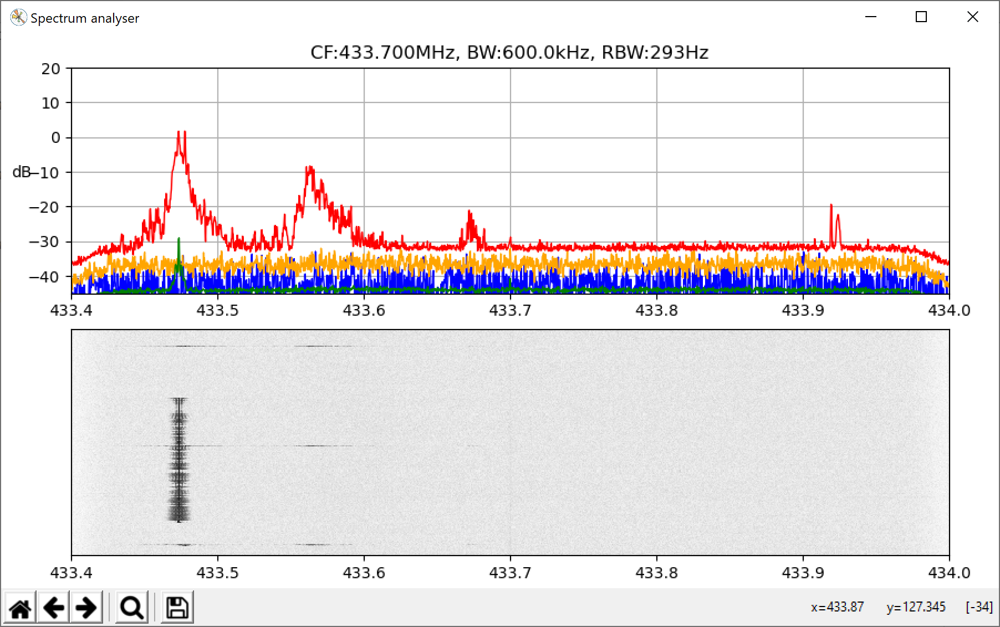

# A Python spectrum analyser 

Takes raw IQ samples from some sdr source to give a live spectrum and spectrogram.

This was an exercise in writing some python. There are speed penalties in keeping to python in this. 
Getting the different SDR platforms to work is through libraries, some were tested on windows, some 
were tested on Ubuntu Linux. Getting a driver to work can be challenging, gnu-radio even has support 
that makes use outside gnu-radio almost impossible (iio). Overall it gave me an idea of what the various 
sdr platforms have to do.

### There are two options for display
    - Most work is now concentrated on the web interface

* matplotlib - The first display written
        
        This display is fairly rudimentary, but should work everywhere. There 
        are mouse controlled options. The display runs as a separate process
        (not thread) so that we don't have problems with the display taking 
        processing time from the input data.
        

   
* web - The second display written
        
        A websocket is used to pass data from the python to the javascript 
        in the browser. The web server and the websocket servers run as 
        separate processes and we use the same queue as we did for the 
        matplotlib display.
        


Performance wise it will depend on your machine. I have certainly kept up with streams of data at over 2Msps.
The display gets updated between 10 and 20fps. The idea is to run real time, i.e. we are going to 
compute an FFT for the sample rate given and just update the display when we can. We remember all 
FFT results between screen updates and do peak holding so that no peak is missed on the display. 

How long the underlying FFT takes to compute will depend on how the underlying libraries are built
and configured. Each time the fft size changes we test all the available fft options to see which is 
the fastest. FFTW seems, on my Ubuntu VM, to be the slowest until you hit 8k - but then i have not 
installed any of the fft libraries from source.

The slowest parts are: converting bytes into floats, re-ordering the fft bins for display, and of
course computing the fft. It would be good to have a faster way of converting raw byte arrays of 
samples to complex 32 bit floats.

The support for various input devices is a plugin architecture. If the python support for an input 
device is not available it cannot be used.

There is a separate plugin architecture for dealing with FFT results. With this you can add processing
to look for spectral spikes etc on the FFT bin results. Currently it only finds peaks and sends results
to stdout or an mqtt server.

## Tested with the following:

    Windows: audio, file, pluto (IP), rtltcp, socket
    Linux  : audio, file, pluto (IP), rtlsdr, rtltcp, socket
             soapy(audio, rtlsdr, sdrplay)
    
    Since, once, getting soapy to work under Linux i have failed to replicate 
        this ever again - pity it was my only interface to an sdrplay device
        
## Examples

Some examples for running from command line.

    python ./SpectrumAnalyser.py -H

    python ./SpectrumAnalyser.py -i?

    python ./SpectrumAnalyser.py -ipluto:192.168.2.1 -c433.92e6 -s600e3 -E -F1024

    python ./SpectrumAnalyser.py -ipluto:192.168.2.1 -c433.92e6 -s1e6 -E 
                            --plugin analysis:peak:threshold:12 
                            --plugin report:mqtt:broker:192.168.0.101 

    python ./SpectrumAnalyser.py -ifile:test.wav -LE -W7.5 -c433.92e6

    python ./SpectrumAnalyser.py -ifile:test.cf433.92.cplx.600000.16le -LE -W7

    python ./SpectrumAnalyser.py -iaudio:1 -s48e3 -F1024 -DE -c0 -iaudio:1

    python ./SpectrumAnalyser.py -irtlsdr:kk -c433.92e6 -s1e6 -E

    python ./src/SpectrumAnalyser.py -isoapy:audio -s48000 -c0 -E

    python ./src/SpectrumAnalyser.py -isoapy:sdrplay -s2e6 c433.92e6 -F2048 -E
    
    python ./src/SpectrumAnalyser.py -isoapy:sdrplay -s2e6 c433.92e6 -F2048 -w8080  
          
          This last one is the WEB interface on 127.0.0.1:8080


## Dependencies

The following python modules should be installed. Optional ones provide specific capabilities.

    Required:
        numpy
        matplotlib
        websockets
        
    Testing:
        pytest
        
    Optional:
        scipy       - another FFT library
        pyfftw      - another FFT library, faster above 8k size
        pyadi-iio   - pluto device
        iio         - pluto device
        pyrtlsdr    - rtlsdr devices
        sounddevice - audio devices
        soapysdr    - soapy support
        paho-mqtt   - mqtt functionality (client)


```
pip3 install -r src/requirements.txt
```

## Raspberry Pi

This will run on a raspberry Pi, but **very** slowly. Much better solution is to run something like rtl_tcp 
on the Pi and stream the samples to the machine running the python. See DataSource_rtltcp.py about making
sure the Pi won't run out of memory if the python can not keep up.

The following was done on a not very clean V4.2 image from https://github.com/luigifreitas/pisdr-image
  
    uname -a 
    Linux pisdr 4.19.75-v7+ #1270 SMP Tue Sep 24 18:45:11 BST 2019 armv7l GNU/Linux
    
    cat /etc/debian_version 
    10.2
    
    cat /proc/device-tree/model
    Raspberry Pi 3 Model B Rev 1.2

    sudo apt install pipenv python-dev libatlas-base-dev python3-tk 

    cd
    tar -zxvf SpectrumAnalyser.tgz
    cd SpectrumAnalyser
    pipenv shell
    pipenv install matplotlib scipy pyrtlsdr sounddevice paho-mqtt

    # Assuming libiio is installed find a copy of iio.py and copy to your environment 
    cp ./libiio/build/bindings/python/iio.py ~/.local/share/virtualenvs/SpectrumAnalyser-cRKFuvKh/lib/python3.7/    
    pipenv install pyadi-iio

    python3 ./src/SpectrumAnalyser.py -i?
    Available sources: ['file', 'pluto', 'rtlsdr', 'socket', 'audio']
    file:Filename 	- Filename, binary or wave, e.g. file:./xyz.cf123.4.cplx.200000.16tbe
    pluto:IP        - The Ip or resolvable name of the Pluto device, e.g. pluto:192.168.2.1
    rtlsdr:Name 	- Name is anything, e.g. rtlsdr:abc
    socket:IP@port 	- The Ip or resolvable name and port on a server, e.g. socket:192.168.2.1@12345
    audio:Number 	- number of the input device e.g. audio:1, '?' for list

    NOTE: pipenv failed to install:
          pyfftw   - Breaks during install, compile problems?
          soapysdr - No matching distribution
          gooey    - Attempts to compile wx and fails
          
    NOTE: 'apt' will install python-fftw but that is not pyfftw, but there is python-pyfftw-doc !?
          There appears to be no support for fftw through pyfftw for python3 on this Linux distro

## TODO
 
    * Convert inputs to streaming interfaces.
    * Drop receivers
    * Record button for raw samples at the server with web interface to recorded files
    * More control of front ends - gain etc
    * Marker to cf
    * Peak marker
    * Errors to web UI
